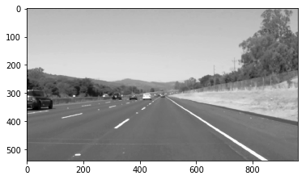
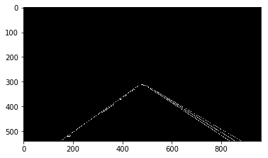
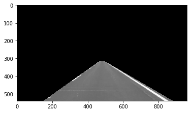
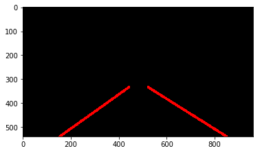
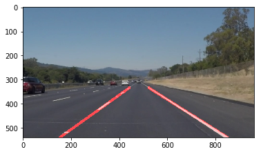

# **Uadcity Self Driving Car Nanodegree Program: Finding Lane Lines on the Road** 

#### This Project is part of Udacity's Self-Driving Car Nanodegree Program(SDC ND) Term 1
---

## **1. Problem statement**

Lane detection is one of the first and foremost task of autonomous navigation. It enables autonomous system to see and learn about its interacting environment.

Goal of this project is to detect the lane markings and draw solid lane lines on a given image

---

## **2. Requirements**

### **Software Packages**
      *Python 3
      *moviepy for videos
      *matplotlib for  mathematical plotting of images
      *OpenCV for basic image Processing techniques
      *numpy for array/matrices manipulations
      *Jupyter Notebook 

### **•	Hands on experience :**
      *Python programming
      *Computer Vision basic principles
      *Knowledge of straight line equations and its parameters from geometry
      
---

## **3. Setting up the environment**
     
Install Anaconda from this [website](https://jupyter.readthedocs.io/en/latest/install.html)
     
or for if you jus want to try on the go then simply open this notebook in Google [Colaboratory](https://colab.research.google.com/notebooks/welcome.ipynb)
     
---

## **4. Proposed Solution**

#### Here I will make a short walk through of our solution structure presented in this notebook

    *Import necessary packages stated i software requirements
    *Define necessary image processing functions
    *Write a new function for Line Extrapolation using straight line equation
    *Define a pipeline function using the above defined functions
    *Now check the performance of each function individually on a single image
    *If we are satisfied with above step, apply pipeline function on all images in the test folder
    *If the output is satisfactory apply the same pipeline function on video file
    *If satisfied with all hyper parameters, accept the challenge

 ---
 
 ## **5. Output**

### In order to plot the lane lines on the given image we have gone through certain image processing steps in sequence  as descried below

### Read Original Image

---

### Convert to Grey Scale

---

### Apply Gaussian Blur

---

### Detect edges using canny edge detection

---

### Define ROI

---

### Apply Hough transform and draw left and right lane

---

### Draw the lines on our original image and display

 
## **6. Short commings of this pipeline**
---

1. All this logic written with a precondition that car is always in the center of lane. But we can guarantee all the time, lets say if the car is starting from your garage no lanes can be found.

2. All this logic written with a precondition that car is always in the center of lane. But we can guarantee all the time, lets say if the car is starting from your garage no lanes can be found.

3. Hyper parameters are playing a very important role in detecting the lane lines. Numerous trail and error attempts should be done on real world data to find a good optimized parameters to maximize the performance of our pipeline.

## **7. Possible Improvements**
---

One possible improvement can be along with lane lines if we can also detect the road edges and extrapolate them to top of image ,then  we will have three triangles in the image. If the road is straight then the area of these triangles always be the same. So using ratio of areas of theses three triangles as parameter, we can also fix the position of lanes lines in the image even if we are not able to plot lanes due to noise in images.

